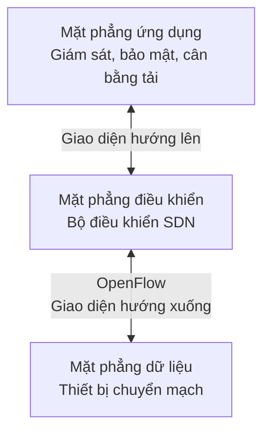
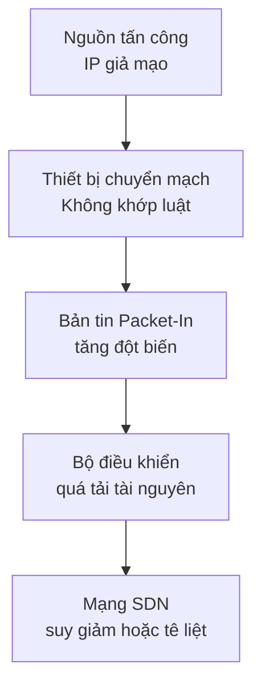

# CHƯƠNG 2: CƠ SỞ LÝ THUYẾT VÀ CÔNG NGHỆ

## Nền tảng cho mô hình phát hiện và ngăn chặn tấn công mạng

- Làm rõ vai trò của SDN, OpenFlow, bộ điều khiển Ryu và Mininet trong mô hình thực nghiệm.
- Trình bày cơ sở IDS/IPS và các hướng tiếp cận phát hiện tấn công.
- Giới thiệu ba kịch bản nghiên cứu: DDoS, dò quét cổng và giả mạo ARP.
- Đặt nền tảng toán học cho phân tích Shannon Entropy trên thống kê luồng.

---
layout: content-card
transition: slide-left
---

# Tổng quan công nghệ sử dụng

<GlassBox title="SDN và OpenFlow" compact>

- Tách mặt phẳng điều khiển khỏi mặt phẳng dữ liệu.
- Cho phép bộ điều khiển quản lý tập trung các thiết bị chuyển mạch.
- OpenFlow là giao diện hướng xuống để cài đặt và truy vấn bảng luồng.

</GlassBox>

<GlassBox title="Bộ điều khiển Ryu" compact>

- Nền tảng phát triển bộ điều khiển SDN mã nguồn mở.
- Viết bằng Python, thuận lợi cho xây dựng ứng dụng mạng.
- Hỗ trợ truy vấn thống kê và cài đặt luật điều khiển qua OpenFlow.

</GlassBox>

<GlassBox title="Mininet" compact>

- Giả lập mạng SDN trên một máy tính.
- Tạo máy trạm, thiết bị chuyển mạch, liên kết và bộ điều khiển ảo.
- Phù hợp cho kiểm thử lặp lại trong môi trường an toàn.

</GlassBox>

<GlassBox title="Công cụ kiểm thử" compact>

- `hping3`: tạo lưu lượng DDoS tốc độ cao.
- `nmap`: thực hiện dò quét cổng.
- `arpspoof`: tạo kịch bản giả mạo ARP.

</GlassBox>

---
layout: content-card
transition: slide-left
---

# Hệ thống phát hiện và ngăn chặn tấn công mạng

<GlassBox title="IDS" compact>

- Hệ thống phát hiện tấn công (Intrusion Detection System - IDS) giám sát lưu lượng hoặc hoạt động mạng.
- Mục tiêu chính là nhận diện dấu hiệu bất thường, hành vi khả nghi hoặc vi phạm chính sách.
- IDS truyền thống thường dừng ở cảnh báo cho quản trị viên.

</GlassBox>

<GlassBox title="IPS trong SDN" compact>

- Hệ thống ngăn chặn tấn công (Intrusion Prevention System - IPS) chủ động xử lý lưu lượng độc hại.
- Trong SDN, IDS có thể kiêm chức năng IPS nhờ quyền cài đặt luật từ bộ điều khiển.
- Khi phát hiện tấn công, bộ điều khiển sinh luật loại bỏ và đẩy xuống bảng luồng.

</GlassBox>

Trong đề tài, bộ điều khiển Ryu giữ vai trò quan sát thống kê luồng, phát hiện bất thường và phản ứng bằng bản tin Flow-Mod.

---
layout: content-card
transition: slide-left
---

# Các hướng tiếp cận phát hiện tấn công

| Hướng tiếp cận | Ưu điểm | Hạn chế |
|---|---|---|
| **Dựa trên chữ ký** | Chính xác với mẫu tấn công đã biết. | Khó phát hiện tấn công mới; kiểm tra sâu gói tin có thể tạo tải lớn. |
| **Dựa trên học máy** | Có khả năng học đặc trưng bất thường. | Cần dữ liệu huấn luyện; chi phí tính toán và suy luận cao. |
| **Thống kê luồng và Entropy** | Nhẹ, phù hợp với SDN; tận dụng bộ đếm trong bảng luồng. | Phụ thuộc ngưỡng; có thể nhận diện nhầm khi lưu lượng hợp lệ tăng đột biến. |

Đề tài lựa chọn thống kê luồng kết hợp Shannon Entropy vì gọn nhẹ, phản hồi nhanh và dễ tích hợp với bộ điều khiển Ryu.

---
layout: content-card
transition: slide-left
---

# Kiến trúc mạng định nghĩa bằng phần mềm

- Mạng định nghĩa bằng phần mềm (Software-Defined Networking - SDN) tách quyết định điều khiển khỏi chuyển tiếp dữ liệu.
- **Mặt phẳng ứng dụng** chứa các ứng dụng giám sát, bảo mật, cân bằng tải.
- **Mặt phẳng điều khiển** có bộ điều khiển giữ vai trò điều phối và ra quyết định.
- **Mặt phẳng dữ liệu** gồm thiết bị chuyển mạch thực thi luật do bộ điều khiển cài đặt.
- OpenFlow thường được dùng để kết nối bộ điều khiển với thiết bị chuyển mạch.

---
layout: content-card
transition: slide-left
---

# Mininet trong mô phỏng mạng SDN

<GlassBox title="Vai trò mô phỏng" compact>

- Tạo mạng SDN ảo gồm máy trạm, thiết bị chuyển mạch, liên kết và bộ điều khiển.
- Sử dụng ảo hóa nhẹ dựa trên không gian tên mạng của Linux.
- Cho phép xây dựng cấu trúc mạng tùy chỉnh bằng Python.

</GlassBox>

<GlassBox title="Giá trị kiểm thử" compact>

- Máy trạm ảo có thể chạy `hping3`, `nmap`, `arpspoof` như môi trường Linux thật.
- Dễ gán vai trò kẻ tấn công, nạn nhân và người dùng hợp lệ.
- Phù hợp để kiểm thử IDS an toàn, có thể lặp lại và kiểm soát tham số.

</GlassBox>

---
layout: content-card
transition: slide-left
---

# OpenFlow và bảng luồng

<GlassBox title="Vai trò của OpenFlow" compact>

- OpenFlow là giao thức giữa bộ điều khiển và thiết bị chuyển mạch.
- Thiết bị chuyển mạch xử lý gói tin dựa trên bảng luồng.
- Bộ điều khiển có thể thêm, sửa, xóa luật chuyển tiếp hoặc luật loại bỏ.
- Bộ đếm thống kê là nguồn dữ liệu chính cho phân tích Entropy.

</GlassBox>

| Thành phần mục luồng | Ý nghĩa |
|---|---|
| Trường đối sánh | IP, MAC, cổng vào, cổng TCP/UDP |
| Độ ưu tiên | Chọn luật cần áp dụng khi có nhiều luật khớp |
| Bộ đếm | Số gói tin, số byte, thời gian tồn tại |
| Hành động | Chuyển tiếp, loại bỏ, chỉnh sửa |
| Thời gian sống | Quy định vòng đời của luật |

---
layout: content-card
transition: slide-left
---

# Cơ chế xử lý gói tin trong OpenFlow

01

Gói tin đi vào thiết bị chuyển mạch.

02

Thiết bị chuyển mạch tra cứu bảng luồng.

03

Nếu không khớp luật, gửi bản tin Packet-In lên bộ điều khiển.

04

Bộ điều khiển phân tích và cài luật mới bằng bản tin Flow-Mod.

05

Nếu là tấn công, cài luật loại bỏ ưu tiên cao để chặn nguồn độc hại.

Cơ chế Packet-In và Flow-Mod cho phép chuyển từ phát hiện bất thường sang ngăn chặn trực tiếp trong mặt phẳng dữ liệu.

---
layout: content-card
transition: slide-left
---

# Bộ điều khiển Ryu

<GlassBox title="Đặc điểm kỹ thuật" compact>

- Ryu là nền tảng phát triển bộ điều khiển SDN mã nguồn mở.
- Được viết bằng Python và hoạt động theo kiến trúc hướng sự kiện.
- Hỗ trợ nhiều phiên bản OpenFlow, bao gồm OpenFlow 1.3.
- Có thể tích hợp giao diện REST để truy vấn thống kê luồng.

</GlassBox>

<GlassBox title="Phù hợp với đề tài" compact>

- Dễ lập trình module IDS và thuật toán Entropy.
- Thuận lợi cho truy vấn định kỳ bộ đếm từ thiết bị chuyển mạch.
- Có thể cài đặt bản tin Flow-Mod để thêm luật loại bỏ.
- Dễ mở rộng trong môi trường Mininet và thiết bị chuyển mạch ảo Open vSwitch.

</GlassBox>

---
layout: content-card
transition: slide-left
---

# Các hình thức tấn công trong phạm vi đề tài

<GlassBox title="DDoS" compact>

- Tạo lượng lớn lưu lượng từ nhiều nguồn hoặc IP giả mạo.
- Làm quá tải băng thông, thiết bị chuyển mạch hoặc bộ điều khiển.
- Trong SDN, có thể gây bùng nổ bản tin Packet-In.

</GlassBox>

<GlassBox title="Dò quét cổng" compact>

- Thăm dò nhiều cổng trên máy nạn nhân.
- Sinh nhiều luồng ngắn hạn trong thời gian ngắn.
- Làm tăng tải xử lý và chiếm không gian bảng luồng.

</GlassBox>

<GlassBox title="Giả mạo ARP" compact>

- Lợi dụng điểm yếu thiếu xác thực của ARP.
- Làm sai lệch ánh xạ giữa địa chỉ MAC và IP.
- Có thể dẫn đến tấn công xen giữa.

</GlassBox>

---
layout: content-card
transition: slide-left
---

# Tác động của DDoS trong SDN

- DDoS trong SDN không chỉ nhắm vào máy nạn nhân mà còn có thể làm quá tải bộ điều khiển.
- Khi có nhiều gói tin lạ, thiết bị chuyển mạch liên tục gửi bản tin Packet-In.
- Bộ điều khiển phải xử lý lượng lớn yêu cầu, gây cạn kiệt CPU, bộ nhớ hoặc băng thông kênh điều khiển.
- Nếu bộ điều khiển mất khả năng xử lý, toàn bộ mạng SDN có thể bị ảnh hưởng.

---
layout: content-card
transition: slide-left
---

# Shannon Entropy trong phân tích lưu lượng

- Shannon Entropy đo mức độ phân tán hoặc bất định của một đặc trưng mạng.
- Đặc trưng có thể là địa chỉ IP nguồn, địa chỉ IP đích hoặc cổng đích.
- Lưu lượng bình thường thường có phân bố ổn định.
- Khi tấn công xảy ra, phân bố bất thường làm giá trị Entropy thay đổi rõ rệt.

<GlassBox title="Công thức" compact>

$$
H(X) = -\sum_{i=1}^{n} p(x_i)\log_2 p(x_i)
$$

- \(X\): đặc trưng cần phân tích.
- \(p(x_i)\): xác suất xuất hiện của giá trị \(x_i\).
- \(n\): số lượng giá trị phân biệt trong mẫu quan sát.

</GlassBox>

---
layout: content-card
transition: slide-left
---

# Cửa sổ thời gian trượt

- Không tính toán trên toàn bộ vòng đời mạng, mà chia dữ liệu theo từng khoảng thời gian.
- Bộ điều khiển định kỳ truy vấn thống kê từ thiết bị chuyển mạch.
- Mỗi khoảng thời gian tạo thành một mẫu quan sát độc lập.
- Entropy được tính trên từng cửa sổ để phát hiện biến động bất thường.
- Cách tiếp cận này giúp phản hồi nhanh và giảm chi phí xử lý.

  
t1

  
t2

  
t3

  
t4

Mỗi cửa sổ tạo một mẫu thống kê luồng để tính \(H(X)\)

---
layout: content-card
transition: slide-left
---

# Diễn giải Entropy theo từng kiểu tấn công

| Trạng thái | Biểu hiện lưu lượng | Dấu hiệu Entropy |
|---|---|---|
| **Bình thường** | Lưu lượng tập trung vào một số nguồn hoặc đích quen thuộc. | Giá trị ổn định trong vùng an toàn. |
| **DDoS** | Nhiều IP nguồn giả mạo hoặc phân tán. | Entropy của IP nguồn tăng mạnh. |
| **Dò quét cổng** | Một nguồn truy cập nhiều cổng đích khác nhau. | Entropy của cổng đích tăng bất thường. |
| **Giả mạo ARP** | Sai lệch ánh xạ MAC-IP trong mạng cục bộ. | Cần đối chiếu ràng buộc MAC-IP, không chỉ dựa vào Entropy. |

---
layout: content-card
transition: slide-left
---

# Tiêu chuẩn và quy chuẩn áp dụng

<GlassBox title="Nền tảng điều khiển" compact>

- **OpenFlow 1.3**: cơ sở cho bảng luồng, bộ đếm thống kê và bản tin điều khiển.
- Quy định cách bộ điều khiển cài đặt luật và nhận dữ liệu từ thiết bị chuyển mạch.

</GlassBox>

<GlassBox title="Giao thức mạng lõi" compact>

- **IPv4**: trích xuất địa chỉ IP nguồn và IP đích.
- **TCP/UDP**: xác định cổng giao vận phục vụ phát hiện dò quét cổng.
- **ARP**: phân tích ánh xạ giữa địa chỉ IP và địa chỉ MAC.

</GlassBox>

Các tiêu chuẩn này giúp mô hình phân tích đúng cấu trúc gói tin và tương tác đúng với thiết bị chuyển mạch OpenFlow.

---
layout: content-card
transition: slide-left
---

# Tổng kết Chương 2

<GlassBox title="Nền tảng công nghệ" compact>

- SDN cung cấp khả năng điều khiển tập trung và lập trình mạng linh hoạt.
- OpenFlow và bảng luồng là nền tảng để thu thập thống kê và thực thi luật ngăn chặn.
- Bộ điều khiển Ryu và Mininet tạo môi trường phù hợp để xây dựng, thử nghiệm IDS.

</GlassBox>

<GlassBox title="Cơ sở phân tích" compact>

- Shannon Entropy là phương pháp nhẹ để phát hiện bất thường dựa trên thống kê luồng.
- Các kịch bản DDoS, dò quét cổng và giả mạo ARP cho thấy nhu cầu phản ứng tự động.
- Nội dung chương này là cơ sở cho Chương 3: Phân tích và thiết kế hệ thống.

</GlassBox>

