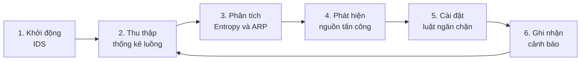
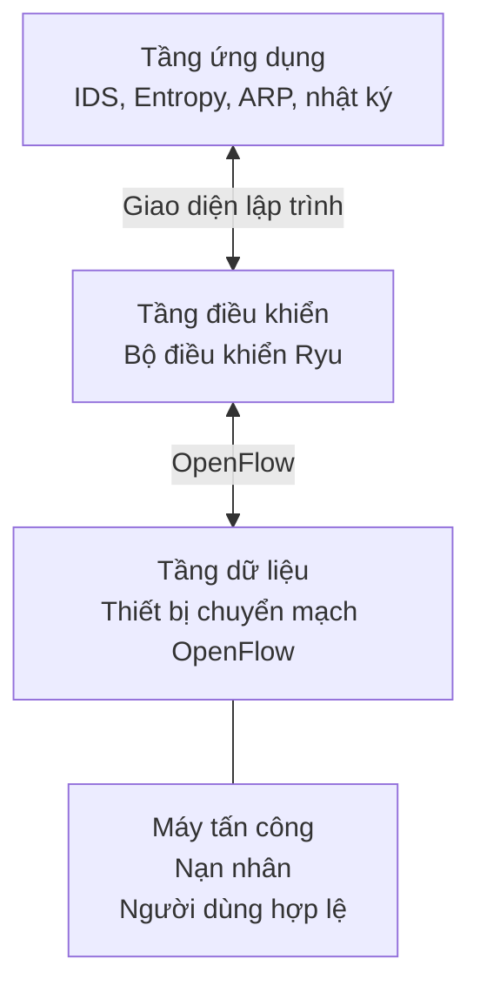
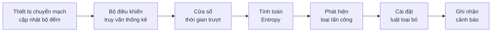
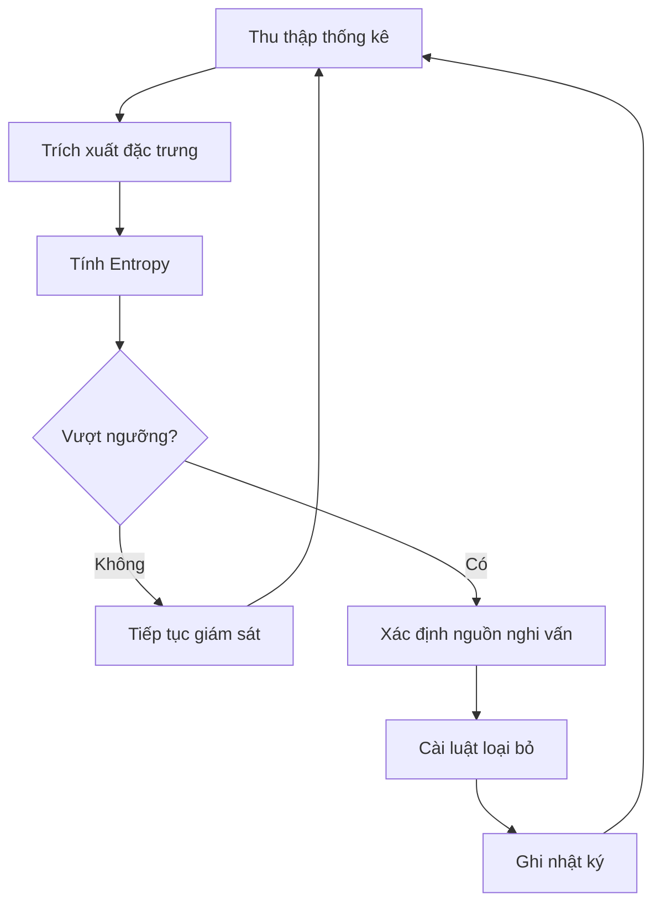
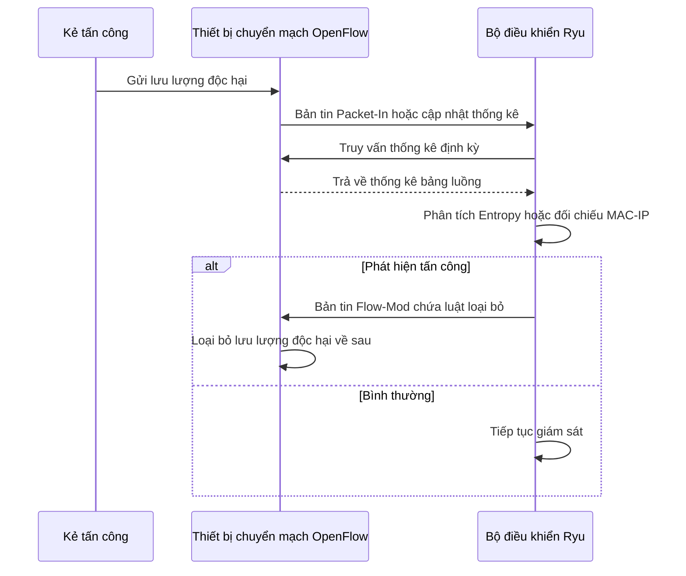

# CHƯƠNG 3: PHÂN TÍCH VÀ THIẾT KẾ HỆ THỐNG

## Yêu cầu, tác nhân, kiến trúc và luồng xử lý

- Trình bày yêu cầu, tác nhân và chức năng chính của hệ thống.
- Mô tả kiến trúc phát hiện và ngăn chặn tấn công mạng trên nền SDN.
- Làm rõ luồng xử lý từ thống kê luồng, Entropy đến luật ngăn chặn.
- Trình bày sơ đồ ca sử dụng, kiến trúc, lưu đồ thuật toán và sơ đồ tuần tự.

---
layout: content-card
transition: slide-left
---

# Mục tiêu thiết kế hệ thống

<GlassBox title="Từ cơ sở lý thuyết" compact>

- Xây dựng hệ thống phát hiện xâm nhập hoạt động trên bộ điều khiển Ryu.
- Thu thập thống kê luồng định kỳ từ thiết bị chuyển mạch OpenFlow.
- Phân tích bất thường bằng Shannon Entropy và đối chiếu MAC-IP.

</GlassBox>

<GlassBox title="Đến thiết kế phòng thủ" compact>

- Tự động cài đặt luật loại bỏ khi phát hiện nguồn tấn công.
- Ghi nhận cảnh báo để phục vụ theo dõi và đánh giá.
- Tổ chức các chức năng theo mô-đun để dễ mở rộng và kiểm thử.

</GlassBox>

---
layout: content-card
transition: slide-left
---

# Yêu cầu chức năng

<GlassBox title="Thu thập dữ liệu" compact>

- Truy vấn định kỳ bảng luồng.
- Lấy số gói tin, số byte và thông tin đặc trưng.
- Loại bỏ dữ liệu không phục vụ phân tích tấn công.

</GlassBox>

<GlassBox title="Phân tích bất thường" compact>

- Tính Entropy cho IP nguồn và cổng đích.
- Phát hiện DDoS và dò quét cổng.
- Phân tích bản tin ARP để phát hiện giả mạo.

</GlassBox>

<GlassBox title="Ngăn chặn chủ động" compact>

- Xác định nguồn vi phạm.
- Sinh luật loại bỏ tương ứng.
- Cài luật xuống thiết bị chuyển mạch OpenFlow.

</GlassBox>

<GlassBox title="Lưu vết và cảnh báo" compact>

- Ghi nhận thời điểm và loại tấn công.
- Lưu địa chỉ vi phạm và giá trị Entropy.
- Hiển thị bản ghi nhật ký trên thiết bị đầu cuối.

</GlassBox>

---
layout: content-card
transition: slide-left
---

# Yêu cầu phi chức năng

<GlassBox title="Hiệu năng vận hành" compact>

- Độ trễ từ phát hiện đến cài luật cần ngắn.
- Ưu tiên thống kê luồng, không dùng kiểm tra sâu gói tin.
- Hạn chế tiêu thụ CPU, bộ nhớ và băng thông kênh điều khiển.

</GlassBox>

<GlassBox title="Độ tin cậy" compact>

- Không làm gián đoạn lưu lượng hợp lệ.
- Bộ điều khiển vẫn duy trì khả năng xử lý khi có tấn công.
- Có thể bổ sung thuật toán hoặc kiểu tấn công mới.

</GlassBox>

---
layout: content-card
transition: slide-left
---

# Tác nhân trong sơ đồ Use Case

<GlassBox title="Quản trị viên mạng" compact>

- Khởi động hoặc dừng ứng dụng phát hiện xâm nhập.
- Theo dõi cảnh báo và bản ghi nhật ký.
- Đánh giá trạng thái an toàn của mạng.
- Không can thiệp vào quá trình tính toán tự động.

</GlassBox>

<GlassBox title="Thiết bị chuyển mạch OpenFlow" compact>

- Cung cấp thống kê từ bảng luồng.
- Gửi bản tin Packet-In khi gặp gói tin chưa có luật xử lý.
- Thực thi luật loại bỏ do bộ điều khiển cài đặt.
- Đóng vai trò nguồn dữ liệu và điểm thực thi phòng thủ.

</GlassBox>

---
layout: content-card
transition: slide-left
---

# Các ca sử dụng cốt lõi

Chu trình được thiết kế để giám sát liên tục, phản ứng tự động và cung cấp thông tin cho quản trị viên.

---
layout: content-card
transition: slide-left
---

# Kiến trúc tổng thể hệ thống

- **Tầng ứng dụng**: mô-đun IDS, phát hiện DDoS, dò quét cổng, giả mạo ARP và ghi nhật ký.
- **Tầng điều khiển**: bộ điều khiển Ryu xử lý sự kiện và gửi lệnh OpenFlow.
- **Tầng dữ liệu**: thiết bị chuyển mạch OpenFlow và các máy trạm trong Mininet.
- Các máy trạm được phân vai: kẻ tấn công, nạn nhân và người dùng hợp lệ.

---
layout: content-card
transition: slide-left
---

# Cấu trúc mô-đun chức năng

<GlassBox title="Thu thập thống kê" compact>
Lấy dữ liệu từ bảng luồng theo chu kỳ.
</GlassBox>

<GlassBox title="Cửa sổ thời gian trượt" compact>
Tổ chức dữ liệu theo từng khoảng quan sát.
</GlassBox>

<GlassBox title="Phân tích Entropy" compact>
Tính mức phân tán của IP nguồn và cổng đích.
</GlassBox>

<GlassBox title="Phát hiện và phân loại" compact>
Nhận diện DDoS, dò quét cổng và giả mạo ARP.
</GlassBox>

<GlassBox title="Ngăn chặn" compact>
Sinh luật loại bỏ và gửi xuống thiết bị chuyển mạch.
</GlassBox>

<GlassBox title="Ghi nhật ký" compact>
Lưu cảnh báo và dữ liệu phục vụ đánh giá.
</GlassBox>

---
layout: content-card
transition: slide-left
---

# Luồng hoạt động liên mô-đun

Luồng dữ liệu khép kín giúp hệ thống vừa quan sát, vừa phản ứng mà không cần can thiệp thủ công trong mỗi chu kỳ.

---
layout: content-card
transition: slide-left
---

# Lưu đồ thuật toán phát hiện

- Thu thập thống kê luồng từ thiết bị chuyển mạch.
- Trích xuất IP nguồn, IP đích, cổng đích và số gói tin.
- Tính Entropy theo cửa sổ thời gian.
- So sánh với ngưỡng an toàn.
- Nếu bất thường, xác định nguồn nghi vấn, ngăn chặn và ghi nhật ký.

---
layout: content-card
transition: slide-left
---

# Logic phát hiện DDoS

<GlassBox title="Dấu hiệu quan sát" compact>

- DDoS làm xuất hiện nhiều IP nguồn hoặc lưu lượng bất thường hướng đến nạn nhân.
- Hệ thống theo dõi Entropy của IP nguồn và tốc độ gói tin.
- Dữ liệu được đánh giá theo từng cửa sổ thời gian.

</GlassBox>

<GlassBox title="Phản ứng phòng thủ" compact>

- Khi vượt ngưỡng, nguồn nghi vấn được đưa vào danh sách xử lý.
- Bộ điều khiển sinh luật loại bỏ cho nguồn hoặc luồng độc hại.
- Luật được cài xuống thiết bị chuyển mạch để giảm tải cho nạn nhân và bộ điều khiển.

</GlassBox>

---
layout: content-card
transition: slide-left
---

# Logic phát hiện dò quét cổng

<GlassBox title="Đặc trưng hành vi" compact>

- Dò quét cổng tạo nhiều kết nối ngắn đến nhiều cổng đích.
- Hệ thống theo dõi sự phân tán cổng đích theo từng IP nguồn.
- Entropy của cổng đích tăng khi một nguồn truy cập nhiều cổng.

</GlassBox>

<GlassBox title="Điều kiện xử lý" compact>

- Số lượng cổng đích hoặc Entropy được so sánh với ngưỡng an toàn.
- Khi vượt ngưỡng, nguồn đó được đánh dấu là nghi vấn.
- Bộ điều khiển áp dụng luật chặn phù hợp trên thiết bị chuyển mạch.

</GlassBox>

---
layout: content-card
transition: slide-left
---

# Logic phát hiện giả mạo ARP

<GlassBox title="Cơ sở phát hiện" compact>

- ARP thiếu cơ chế xác thực nên dễ bị giả mạo.
- Hệ thống xây dựng bảng ràng buộc MAC-IP tin cậy.
- Bản tin ARP mới được đối chiếu với bảng này.

</GlassBox>

<GlassBox title="Phản ứng" compact>

- Nếu MAC và IP sai lệch, hệ thống cảnh báo nguy cơ giả mạo ARP.
- Nguồn phát tán bản tin giả mạo có thể bị cô lập.
- Cơ chế này bổ sung cho Entropy vì giả mạo ARP không nhất thiết tạo biến động thống kê lớn.

</GlassBox>

---
layout: content-card
transition: slide-left
---

# Sơ đồ tuần tự xử lý tấn công

---
layout: content-card
transition: slide-left
---

# Tổng kết Chương 3

<GlassBox title="Kết quả thiết kế" compact>

- Xác định yêu cầu chức năng và phi chức năng của hệ thống.
- Kiến trúc được tổ chức theo mô hình phân tầng của SDN.
- Các mô-đun chính gồm thu thập, xử lý, phát hiện, ngăn chặn và ghi nhật ký.

</GlassBox>

<GlassBox title="Cơ sở triển khai" compact>

- Cơ chế phòng thủ dựa trên thống kê luồng, Entropy và đối chiếu MAC-IP.
- Luồng xử lý hỗ trợ phản ứng tự động bằng luật loại bỏ.
- Thiết kế này là nền tảng để triển khai thực nghiệm trong Chương 4.

</GlassBox>

