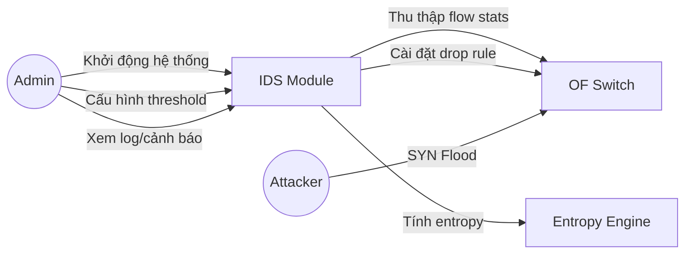
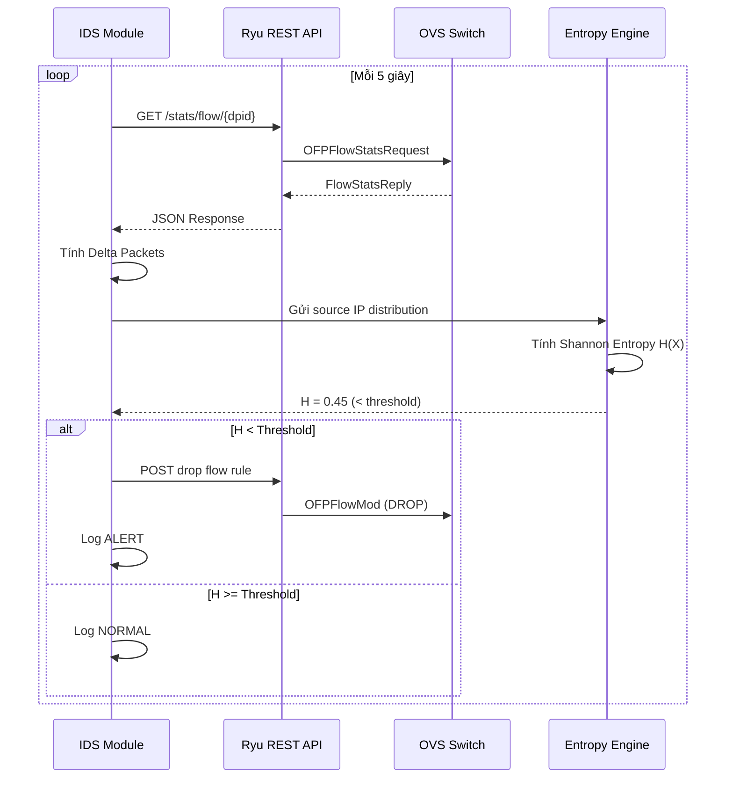

# Chương 3

## Phân tích & Thiết kế Hệ thống

Yêu cầu, use case, kiến trúc và thiết kế dữ liệu

---
layout: content-card
transition: slide-left
---

# 3.1 Phân tích yêu cầu

<GlassBox title="Yêu cầu chức năng" icon="⚙️">

<v-clicks>

- **FR-01**: Thu thập flow statistics từ OpenFlow switches mỗi 5 giây
- **FR-02**: Tính toán delta packets cho từng flow entry
- **FR-03**: Duy trì sliding window 20s (buffer 4 mẫu)
- **FR-04**: Tính Shannon Entropy cho source IP distribution
- **FR-05**: Phát cảnh báo khi entropy < threshold (1.0)
- **FR-06**: Tự động install drop flow rule chặn attacker IP
- **FR-07**: Ghi log đầy đủ (timestamp, entropy, action)

</v-clicks>

</GlassBox>

<GlassBox title="Yêu cầu phi chức năng" icon="📊">

<v-clicks>

- **NFR-01**: Thời gian phát hiện ≤ 10 giây từ khi bắt đầu tấn công
- **NFR-02**: False Positive Rate < 5%
- **NFR-03**: CPU Controller < 30% khi polling
- **NFR-04**: Hỗ trợ ≥ 500 flow entries đồng thời
- **NFR-05**: Uptime 99.9% (trong môi trường lab)
- **NFR-06**: Code tuân thủ PEP 8, docstring đầy đủ

</v-clicks>

</GlassBox>

---
layout: content-card
transition: slide-left
---

# 3.2 Sơ đồ Use Case

<GlassBox title="UC-01: Thu thập Flow Stats" compact>

| Thuộc tính | Mô tả |
|---|---|
| **Actor** | IDS Module (tự động) |
| **Tiền điều kiện** | Controller kết nối Switch |
| **Luồng chính** | 1. Gửi GET request → REST API |
|  | 2. Parse JSON response |
|  | 3. Tính delta packets |
|  | 4. Lưu vào sliding window |
| **Ngoại lệ** | API timeout → retry 3 lần |

</GlassBox>

---
layout: content-card
transition: slide-left
---

# 3.3 Thiết kế kiến trúc hệ thống

  <SdnTopology :width="500" />

  
Application Layer

  
IDS Module + Entropy Engine

  
Control Layer

  
Ryu Controller + REST API

  
Data Layer

  
OVS Switches + Hosts (Mininet)

---
layout: content-card
transition: slide-left
---

# 3.4 Thiết kế cơ sở dữ liệu

<GlassBox title="Schema — Flow Statistics Buffer" icon="🗄️">

| Trường | Kiểu dữ liệu | Mô tả |
|---|---|---|
| `timestamp` | `datetime` | Thời điểm thu thập |
| `dpid` | `int` | Datapath ID của switch |
| `src_ip` | `str` | Source IP address |
| `dst_ip` | `str` | Destination IP address |
| `packet_count` | `int` | Tổng packet count (cumulative) |
| `delta_packets` | `int` | Packets mới trong chu kỳ |
| `byte_count` | `int` | Tổng byte count |
| `entropy` | `float` | Shannon entropy tại thời điểm |
| `is_attack` | `bool` | Flag cảnh báo tấn công |

</GlassBox>

> **Lưu ý:** Hệ thống sử dụng **in-memory buffer** (`collections.deque`) thay vì database truyền thống để đảm bảo tốc độ xử lý real-time. Dữ liệu log được ghi ra file CSV để phân tích sau.

---
layout: content-card
transition: slide-left
---

# 3.5 – 3.7 Thiết kế luồng dữ liệu & Sequence Diagram

