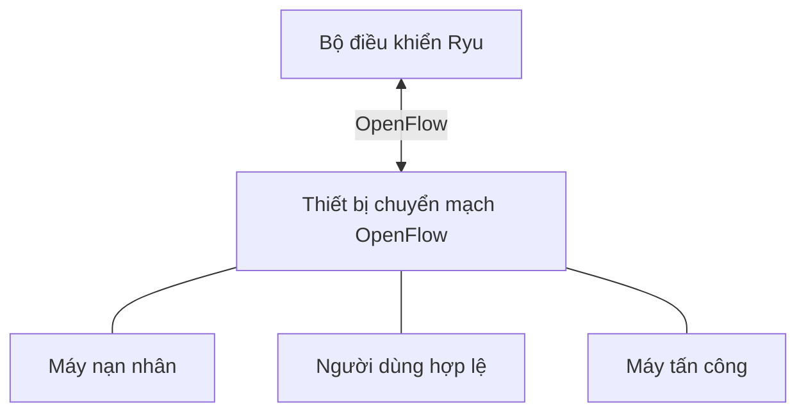
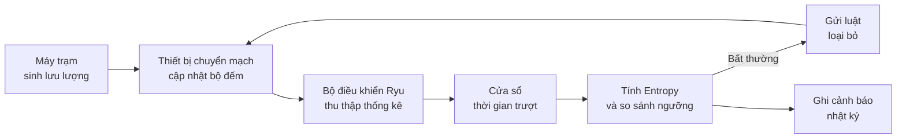
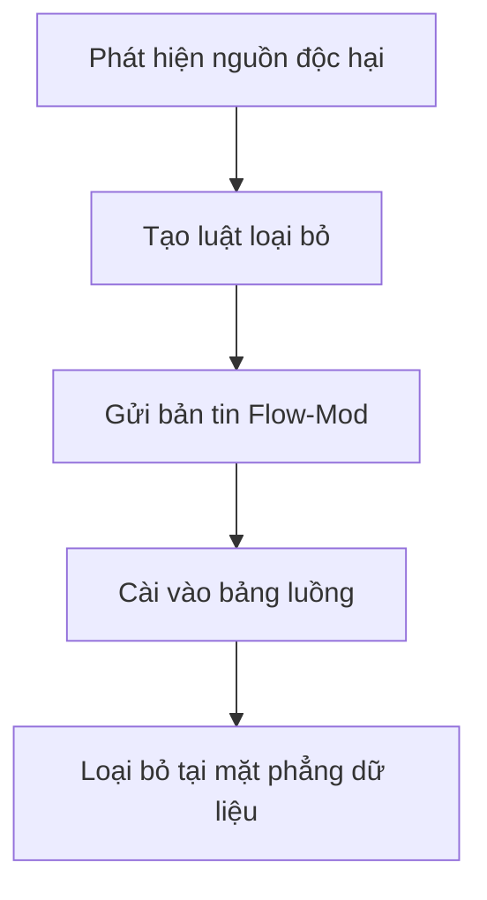

# CHƯƠNG 4: TRIỂN KHAI THỰC NGHIỆM VÀ ĐÁNH GIÁ

## Môi trường, triển khai, kiểm thử và nhận xét kết quả

- Trình bày môi trường phát triển và cấu trúc mạng thực nghiệm.
- Mô tả cách triển khai các mô-đun chính của hệ thống IDS.
- Xây dựng kịch bản kiểm thử DDoS, dò quét cổng và giả mạo ARP.
- Đánh giá khả năng phát hiện, ngăn chặn và ghi nhận cảnh báo.

---
layout: content-card
transition: slide-left
---

# Môi trường phát triển

<div class="divider"></div>

<div style="display:grid;grid-template-columns:1fr 1fr;gap:18px;margin-top:14px;">

<GlassBox title="Nền tảng triển khai" compact>

- Hệ điều hành Linux hoặc máy ảo phục vụ chạy Mininet.
- Bộ điều khiển Ryu chạy ứng dụng phát hiện xâm nhập.
- Mininet và Open vSwitch mô phỏng mạng SDN.
- Python được dùng để xây dựng mô-đun xử lý và kịch bản mạng.

</GlassBox>

<GlassBox title="Công cụ kiểm thử" compact>

- `hping3`: tạo lưu lượng kiểm thử DDoS.
- `nmap`: kiểm tra kịch bản dò quét cổng.
- `arpspoof`: kiểm thử giả mạo ARP.
- Bản ghi nhật ký trên thiết bị đầu cuối dùng để theo dõi cảnh báo.

</GlassBox>

</div>

---
layout: content-card
transition: slide-left
---

# Cấu trúc mạng thực nghiệm

<div class="divider"></div>

<div style="display:grid;grid-template-columns:0.95fr 1.05fr;gap:18px;margin-top:10px;align-items:start;">

<div>

- Mạng được xây dựng trong Mininet theo cấu trúc liên kết hình sao.
- Các máy trạm gồm nhóm tấn công, nhóm nạn nhân và nhóm người dùng hợp lệ.
- Các máy kết nối qua thiết bị chuyển mạch OpenFlow.
- Bộ điều khiển Ryu quản lý thiết bị chuyển mạch và thu thập thống kê.
- Cấu trúc mạng hỗ trợ sinh lưu lượng bình thường và lưu lượng tấn công.

</div>

<div>



</div>

</div>

---
layout: content-card
transition: slide-left
---

# Cấu trúc thư mục dự án

<div class="divider"></div>

<div style="display:grid;grid-template-columns:1.05fr 0.95fr;gap:18px;margin-top:10px;">

<div>

```text
SDN-IDS/
├── src/
│   ├── topology.py
│   ├── ids_detector.py
│   ├── arp_monitor.py
│   ├── mitigation.py
│   ├── test_ids.py
│   └── topology_viewer.py
├── scripts/
│   ├── ddos.sh
│   ├── port_scan.sh
│   └── arp_spoofing.sh
├── alerts.log
├── test_results.json
└── pyproject.toml
```

</div>

<GlassBox title="Vai trò chính" compact>

- `topology.py`: định nghĩa cấu trúc mạng Mininet.
- `ids_detector.py`: xử lý thống kê, Entropy và bất thường.
- `arp_monitor.py`: giám sát ràng buộc MAC-IP.
- `mitigation.py`: cài đặt cơ chế ngăn chặn.
- `alerts.log`: lưu cảnh báo và kết quả xử lý.

</GlassBox>

</div>

---
layout: content-card
transition: slide-left
---

# Luồng dữ liệu khi hệ thống vận hành

<div class="divider"></div>

<div style="margin-top:12px;">



</div>

---
layout: content-card
transition: slide-left
---

# Cài đặt thuật toán Shannon Entropy

<div class="divider"></div>

<div style="display:grid;grid-template-columns:1fr 1fr;gap:18px;margin-top:10px;">

<div>

- Đầu vào là tập giá trị đặc trưng trong một cửa sổ thời gian.
- Tần suất xuất hiện của từng giá trị được chuyển thành xác suất.
- Entropy phản ánh mức độ phân tán của lưu lượng.
- Kết quả được dùng để so sánh với ngưỡng an toàn.

</div>

<GlassBox title="Công thức và giả mã" compact>

$$
H(X) = -\sum_{i=1}^{n} p(x_i)\log_2 p(x_i)
$$

```text
đếm tần suất từng giá trị
tính xác suất p(x_i)
cộng -p(x_i) * log2(p(x_i))
trả về H(X)
```

</GlassBox>

</div>

---
layout: content-card
transition: slide-left
---

# Cửa sổ thời gian trượt trong triển khai

<div class="divider"></div>

<div style="display:grid;grid-template-columns:1fr 1fr;gap:18px;margin-top:14px;">

<GlassBox title="Cách tổ chức dữ liệu" compact>

- Dữ liệu thống kê được thu thập theo chu kỳ.
- Mỗi chu kỳ đóng vai trò là một cửa sổ quan sát.
- Hệ thống phân tích phần lưu lượng mới phát sinh thay vì toàn bộ dữ liệu cũ.

</GlassBox>

<GlassBox title="Ý nghĩa triển khai" compact>

- Giảm chi phí xử lý trên bộ điều khiển.
- Phản ánh trạng thái lưu lượng gần thời điểm hiện tại.
- Phù hợp với yêu cầu phát hiện gần thời gian thực.

</GlassBox>

</div>

---
layout: content-card
transition: slide-left
---

# Phát hiện DDoS trong triển khai

<div class="divider"></div>

<div style="display:grid;grid-template-columns:1fr 1fr;gap:18px;margin-top:14px;">

<GlassBox title="Theo dõi bất thường" compact>

- Giám sát số lượng gói tin và mức phân tán của IP nguồn.
- Lưu lượng tăng đột biến hoặc IP nguồn phân tán bất thường tạo cảnh báo.
- Kết quả phân tích được cập nhật theo cửa sổ thời gian.

</GlassBox>

<GlassBox title="Kích hoạt ngăn chặn" compact>

- Nguồn nghi vấn hoặc luồng độc hại được đưa vào cơ chế ngăn chặn.
- Luật loại bỏ được cài xuống thiết bị chuyển mạch.
- Cách xử lý này giảm tải cho bộ điều khiển và máy nạn nhân.

</GlassBox>

</div>

---
layout: content-card
transition: slide-left
---

# Phát hiện dò quét cổng trong triển khai

<div class="divider"></div>

<div style="display:grid;grid-template-columns:1fr 1fr;gap:18px;margin-top:14px;">

<GlassBox title="Dữ liệu quan sát" compact>

- Ghi nhận số lượng cổng đích mà một IP nguồn truy cập.
- Nhiều kết nối ngắn đến nhiều cổng là dấu hiệu nghi vấn.
- Entropy hoặc số lượng cổng đích được dùng để xác định bất thường.

</GlassBox>

<GlassBox title="Phản ứng" compact>

- Khi vượt ngưỡng, hệ thống sinh cảnh báo dò quét cổng.
- Nguồn nghi vấn được chuyển sang mô-đun ngăn chặn.
- Luật chặn được áp dụng phù hợp với nguồn vi phạm.

</GlassBox>

</div>

---
layout: content-card
transition: slide-left
---

# Phát hiện và ngăn chặn giả mạo ARP

<div class="divider"></div>

<div style="display:grid;grid-template-columns:1fr 1fr;gap:18px;margin-top:14px;">

<GlassBox title="Kiểm tra ràng buộc" compact>

- Duy trì bảng ánh xạ MAC-IP tin cậy.
- Bản tin ARP mới được kiểm tra với bảng ánh xạ này.
- Nếu một IP xuất hiện với MAC không hợp lệ, hệ thống xác định nguy cơ giả mạo.

</GlassBox>

<GlassBox title="Bảo vệ tầng liên kết" compact>

- Cảnh báo được ghi nhận vào bản ghi nhật ký.
- Nguồn vi phạm có thể bị cô lập khỏi mạng nội bộ.
- Cơ chế này bảo vệ tầng liên kết dữ liệu trong môi trường SDN.

</GlassBox>

</div>

---
layout: content-card
transition: slide-left
---

# Cơ chế ngăn chặn tự động

<div class="divider"></div>

<div style="display:grid;grid-template-columns:0.95fr 1.05fr;gap:18px;margin-top:10px;align-items:start;">

<div>

- Khi phát hiện nguồn độc hại, hệ thống tạo luật loại bỏ.
- Luật được gửi xuống thiết bị chuyển mạch bằng bản tin Flow-Mod.
- Luật có độ ưu tiên cao để chặn trước các luật chuyển tiếp thông thường.
- Lưu lượng độc hại bị loại bỏ ngay tại mặt phẳng dữ liệu.
- Bộ điều khiển giảm tải vì không phải xử lý lặp lại cùng nguồn tấn công.

</div>

<div>



</div>

</div>

---
layout: content-card
transition: slide-left
---

# Các kịch bản kiểm thử

<div class="divider"></div>

<div style="margin-top:10px;">

| Kịch bản | Mục tiêu | Dấu hiệu cần quan sát | Kết quả mong đợi |
|---|---|---|---|
| Lưu lượng bình thường | Kiểm tra không cảnh báo sai | Entropy ổn định | Không cài luật chặn |
| DDoS | Phát hiện lưu lượng tăng đột biến | IP nguồn hoặc tốc độ gói tin bất thường | Cảnh báo và chặn nguồn độc hại |
| Dò quét cổng | Phát hiện truy cập nhiều cổng | Cổng đích phân tán bất thường | Cảnh báo và áp dụng luật chặn |
| Giả mạo ARP | Kiểm tra đối chiếu MAC-IP | Ánh xạ sai lệch | Cảnh báo và cô lập nguồn giả mạo |

</div>

---
layout: content-card
transition: slide-left
---

# Tiêu chí đánh giá

<div class="divider"></div>

<div style="display:grid;grid-template-columns:repeat(2,1fr);gap:14px;margin-top:14px;">

<GlassBox title="Khả năng phát hiện" compact>

- Phát hiện đúng loại tấn công trong từng kịch bản.
- Thời gian từ bất thường đến cảnh báo cần ngắn.
- Tỷ lệ cảnh báo nhầm được xem xét khi có lưu lượng hợp lệ tăng đột biến.

</GlassBox>

<GlassBox title="Khả năng phản ứng" compact>

- Cài đặt luật chặn tự động sau khi phát hiện.
- Hạn chế ảnh hưởng đến lưu lượng hợp lệ.
- Bộ điều khiển duy trì ổn định khi có tấn công.

</GlassBox>

</div>

---
layout: content-card
transition: slide-left
---

# Kết quả thực nghiệm

<div class="divider"></div>

<div style="display:grid;grid-template-columns:1fr 1fr;gap:18px;margin-top:14px;">

<GlassBox title="Kết quả quan sát" compact>

- Hệ thống phát hiện được biến động bất thường trong các kịch bản kiểm thử.
- Entropy phù hợp với DDoS và dò quét cổng nhờ khả năng đo mức phân tán lưu lượng.
- Đối chiếu MAC-IP hỗ trợ phát hiện giả mạo ARP.

</GlassBox>

<GlassBox title="Nhận định thận trọng" compact>

- Luật loại bỏ được cài xuống thiết bị chuyển mạch để ngăn lưu lượng độc hại.
- Cần tiếp tục tinh chỉnh ngưỡng để giảm cảnh báo nhầm.
- Trường hợp lưu lượng hợp lệ tăng đột biến vẫn cần được đánh giá thêm.

</GlassBox>

</div>

---
layout: content-card
transition: slide-left
---

# Nhận xét sau thực nghiệm

<div class="divider"></div>

<div style="display:grid;grid-template-columns:1fr 1fr;gap:18px;margin-top:14px;">

<GlassBox title="Điểm phù hợp" compact>

- Thống kê luồng giúp giảm chi phí xử lý so với kiểm tra sâu gói tin.
- Xử lý tại bộ điều khiển cho phép phản hồi tập trung và linh hoạt.
- Luật loại bỏ ở mặt phẳng dữ liệu giúp giảm tải cho bộ điều khiển.

</GlassBox>

<GlassBox title="Giới hạn cần lưu ý" compact>

- Hạn chế chính nằm ở việc lựa chọn ngưỡng phát hiện.
- Mininet phù hợp cho kiểm chứng ban đầu nhưng chưa thay thế mạng thực tế.
- Cần đánh giá thêm trên quy mô lớn hơn hoặc thiết bị SDN vật lý.

</GlassBox>

</div>

---
layout: content-card
transition: slide-left
---

# Tổng kết Chương 4

<div class="divider"></div>

<div style="display:grid;grid-template-columns:1fr 1fr;gap:18px;margin-top:14px;">

<GlassBox title="Triển khai" compact>

- Chương 4 đã trình bày môi trường và cấu trúc mạng thực nghiệm.
- Các mô-đun chính được triển khai trên nền Ryu và Mininet.
- Kịch bản kiểm thử gồm DDoS, dò quét cổng và giả mạo ARP.

</GlassBox>

<GlassBox title="Đánh giá" compact>

- Kết quả cho thấy thống kê luồng kết hợp Entropy có tính khả thi trong SDN.
- Cơ chế đối chiếu MAC-IP bổ sung cho phát hiện giả mạo ARP.
- Các hạn chế thực nghiệm là cơ sở cho hướng phát triển ở Chương 5.

</GlassBox>

</div>
